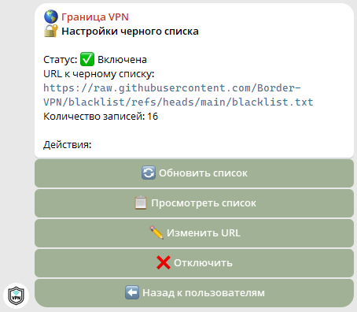
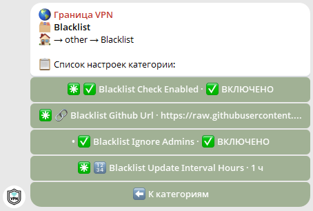

# 🌍 Граница VPN — Черный список

[](https://github.com/Border-VPN/blacklist/actions/workflows/sync-blacklist.yml) [](https://github.com/Border-VPN/blacklist/actions/workflows/validate-blacklist.yml)

## Описание

Этот репозиторий содержит черный список пользователей, которым запрещен доступ к Telegram-боту VPN‑сервиса **«🌍 Граница VPN»**. Список используется ботом для блокировки доступа и автоматически импортируется по RAW‑ссылке.

## Файл

- `blacklist.txt` — основной список; каждый пользователь указывается на новой строке.

## Как использовать — варианты

### Вариант 1 — через админ‑панель (Telegram-бот) ⚙️

1. Перейдите в админ‑панель Telegram-бота.
2. Откройте меню «👥 Юзеры / Подписки» → «👥 Пользователи» → «🔐 Черный список».



Либо перейдите в админ-панель Telegram-бота → «⚙️ Настройки» → «🧩 Конфигурация бота» → «📦 Прочие настройки» → «Blacklist».



> Используйте настройки Telegram-бота для добавления/удаления пользователей — изменения будут сохранены в Вашем локальном `blacklist.txt`.

### Вариант 2 — из файла окружения (.env)

Если вы предпочитаете переменные окружения, то добавьте строки из `.env.example` в ваш `.env`:

```dotenv
BLACKLIST_CHECK_ENABLED=true
BLACKLIST_GITHUB_URL=https://raw.githubusercontent.com/BorderVPN/blacklist/refs/heads/main/blacklist.txt
BLACKLIST_UPDATE_INTERVAL_HOURS=1
BLACKLIST_IGNORE_ADMINS=true
```

Настройте значения по необходимости и **перезапустите бот**, чтобы изменения вступили в силу.

## Обновление

Список автоматически обновляется и импортируется раз в час по RAW‑ссылке.

## Как внести изменения

Создайте [Issue](../../issues/new) по шаблону для заявки на добавление/удаление пользователя из черного списка.

**Альтернативно:** Откройте Pull Request с изменениями в `blacklist.txt` (добавление/удаление строк).

## Формат записей

- Пустые строки и комментарии (начинаются с `#`) игнорируются.
- Каждая запись должна быть на отдельной строке.
- Допустимые форматы:
  - `@username` — Telegram username (5–32 символа, буквы, цифры, нижнее подчеркивание), например `@example_user`.
  - `123456789` — Telegram numeric ID (целое число, возможно со знаком `-`).

## CI — проверка формата

При открытии Pull Request автоматический CI запускает скрипт `scripts/validate_blacklist.py`, который проверяет формат записей и отсутствие дубликатов. Локально можно выполнить:

```bash
python scripts/validate_blacklist.py
```

Если проверка завершится с ошибкой — исправьте проблемные строки в `blacklist.txt` и повторите PR.

## CI/CD — автоматическая синхронизация из upstream‑репозиториев

Добавлен workflow `.github/workflows/sync-blacklist.yml`, который выполняется по расписанию (каждые 24 часа) и автоматически синхронизирует чёрный список из upstream‑репозиториев:

1. **`BEDOLAGA-DEV/VPN-BLACKLIST`** — основной upstream.
2. **`Blin4ickUSE/ban-vpn`** — дополнительный список.
3. **`nerioff1337/bedolagam-ban`** — дополнительный список.

Процесс:

1. Получает `blacklist.txt` из upstream‑репозиториев.
2. Последовательно объединяет их с текущим `blacklist.txt`, нормализует записи и убирает дубликаты (скрипт: `scripts/merge_blacklist.py`).
   - **Важно:** inline‑комментарии (все после `#` на строке) сохраняются. Для дубликатов сохраняется комментарий из первой встреченной записи.
3. Запускает валидацию (`scripts/validate_blacklist.py`).
4. Создает Pull Request с изменениями (по умолчанию) или — при установке секрета `PUSH_DIRECT=true` — пушит изменения прямо в `main`.

Вы можете запустить задачу вручную через Actions -> Sync blacklist -> Run workflow (workflow_dispatch).
